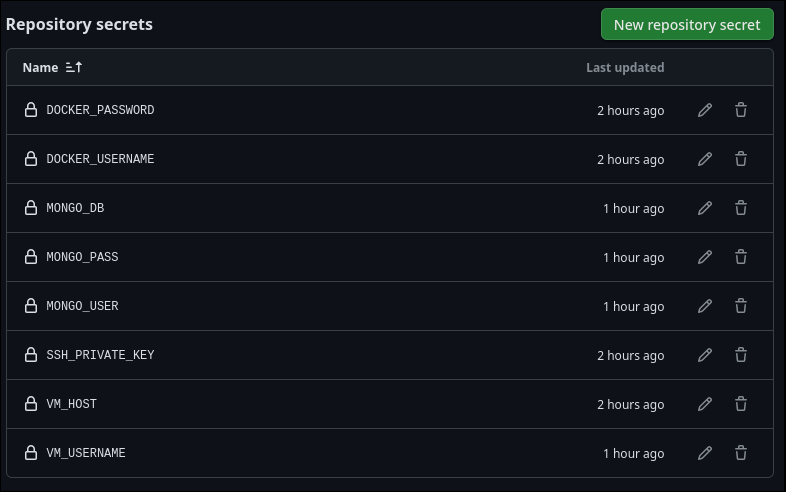
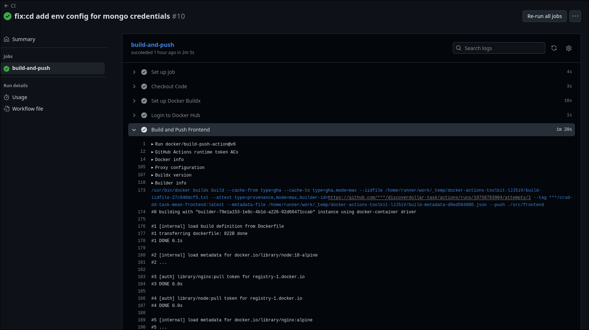
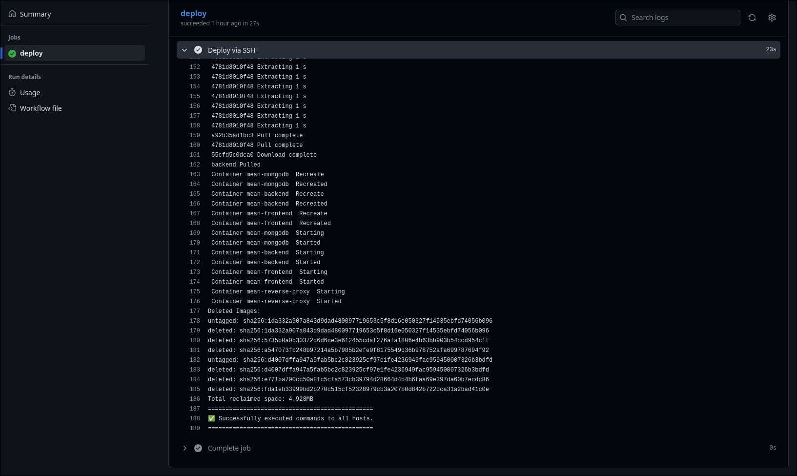
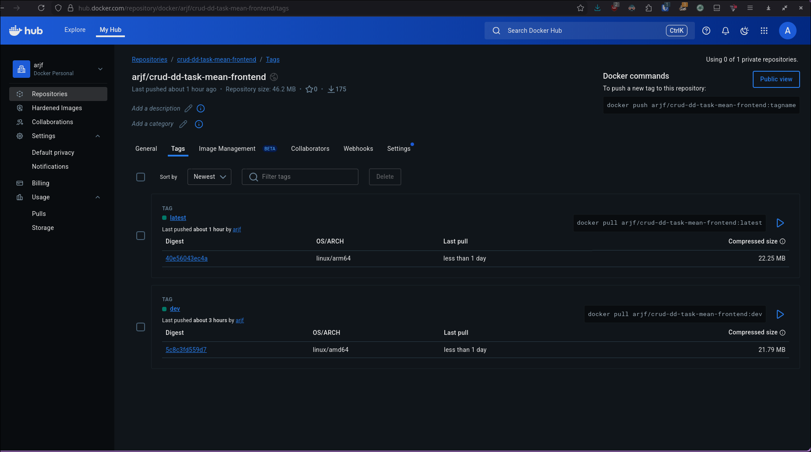
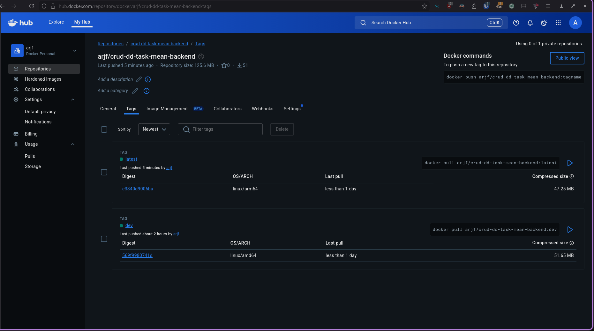
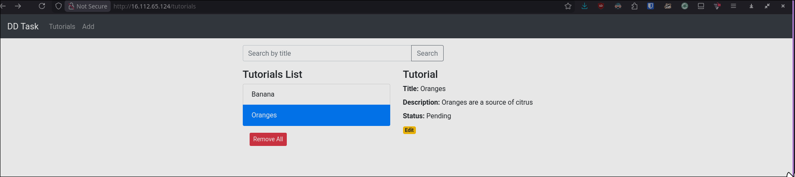
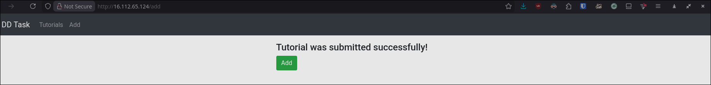
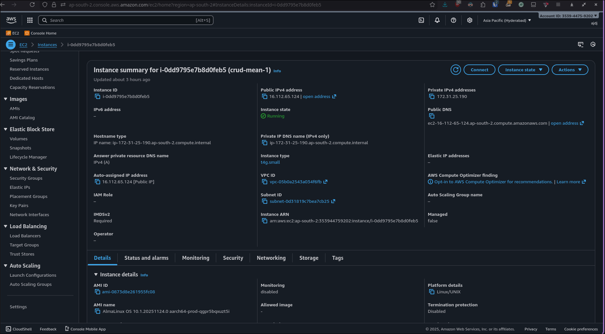
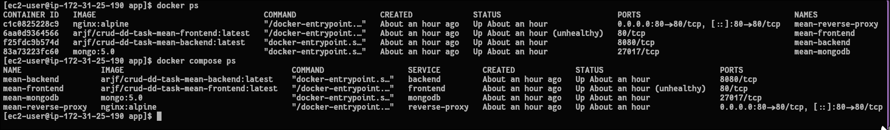
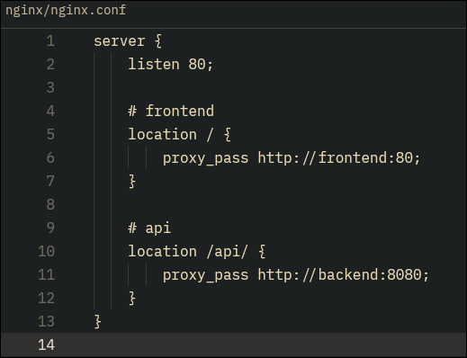

# MEAN Stack - DevOps Deployment

This repository contains the containerized deployment of the provided MEAN CRUD application, deployed on AWS EC2 with CI/CD automation using GitHub Actions.

## Technology Stack

| Component | Technology |
|-----------|------------|
| Containerization | Docker, Docker Compose |
| Reverse Proxy | Nginx |
| CI/CD | GitHub Actions |
| Cloud Platform | AWS EC2 |
| Container Registry | Docker Hub |


## Deployment

### VM Setup

1. Launch an EC2 instance on AWS (tested on AlmaLinux 10, ARM64, t4g.small).

2. Configure security group to allow inbound traffic on:
   - Port 22 (SSH)
   - Port 80 (HTTP)

3. Install Docker and Docker Compose on the VM:

```
sudo dnf config-manager --add-repo https://download.docker.com/linux/centos/docker-ce.repo
sudo dnf install -y docker-ce docker-ce-cli containerd.io docker-buildx-plugin docker-compose-plugin
sudo usermod -aG docker $USER
```

4. Clone the repository and configure environment:

```
git clone https://github.com/arjf/discoverdollar-task.git ~/app
cd ~/app
cp .env.example .env
# Edit .env with production credentials
```

5. Deploy the application:

```
docker compose up -d
```

## CI/CD Pipeline

The project uses GitHub Actions

### CI Pipeline (.github/workflows/ci.yaml)

Triggered on push to the `main` branch. This pipeline:

1. Checks out the repository code
2. Sets up Docker Buildx for multi-platform builds
3. Authenticates with Docker Hub
4. Builds the frontend Docker image and pushes to Docker Hub
5. Builds the backend Docker image and pushes to Docker Hub

### CD Pipeline (.github/workflows/cd.yaml)

Triggered automatically after successful CI pipeline completion. This pipeline:

1. Connects to the VM via SSH
2. Pulls the latest code from the repository
3. Updates environment configuration
4. Pulls the latest Docker images from Docker Hub
5. Restarts the containers with zero downtime
6. Cleans up unused Docker resources

### Required GitHub Secrets

The following secrets must be configured in the GitHub repository:

| Secret | Description |
|--------|-------------|
| `DOCKER_USERNAME` | Docker Hub username |
| `DOCKER_PASSWORD` | Docker Hub access token |
| `VM_HOST` | Public IP address of the EC2 instance |
| `VM_USERNAME` | SSH username for the EC2 instance |
| `SSH_PRIVATE_KEY` | SSH key for VM access |
| `MONGO_USER` | MongoDB root username |
| `MONGO_PASS` | MongoDB root password |
| `MONGO_DB` | MongoDB database name |

## Infrastructure Details

### Docker Compose Services

| Service | Image | Internal Port | Description |
|---------|-------|---------------|-------------|
| `frontend` | `arjf/crud-dd-task-mean-frontend:latest` | 80 | Angular frontend served via Nginx |
| `backend` | `arjf/crud-dd-task-mean-backend:latest` | 8080 | Node.js REST API |
| `mongodb` | `mongo:5.0` | 27017 | MongoDB database |
| `reverse-proxy` | `nginx:alpine` | 80 | nginx reverse proxy |

### Nginx Reverse Proxy Configuration

The reverse proxy routes requests as follows:

- `/` routes to the frontend container
- `/api/*` routes to the backend container

### Persistence

MongoDB data is persisted using a Docker volume (`mongodb_data`)

## Screenshots

### Secrets

#### Repository Secrets


### CI/CD Pipeline Execution

#### CI Pipeline


#### CD Pipeline


### Docker Hub Images

#### Docker Hub repo: frontend


#### Docker Hub repo: backend


### Application UI

#### Tutorial List


#### Tutorial Submit Success


### Infrastructure Overview

#### EC2 Instance Information


#### Container Status


#### Nginx Reverse Proxy Setup

